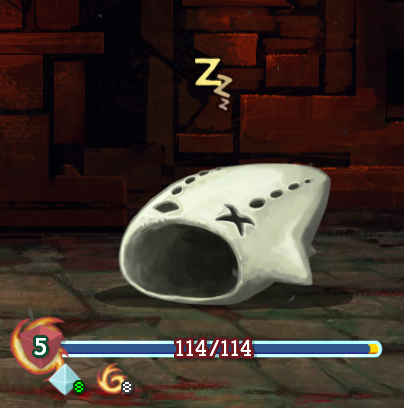
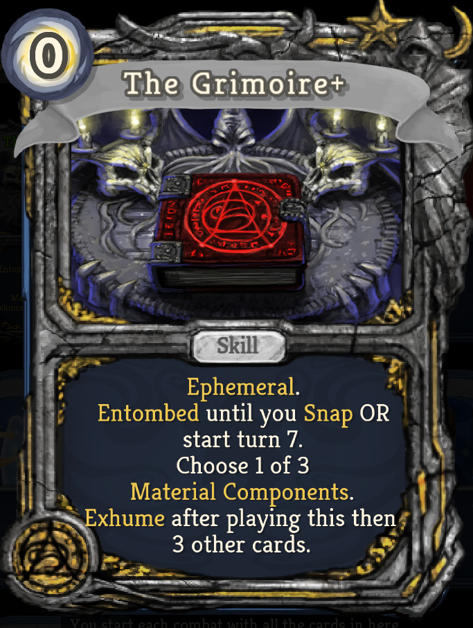
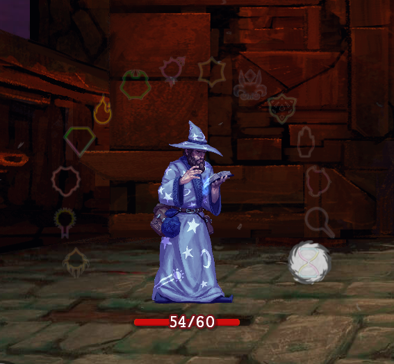
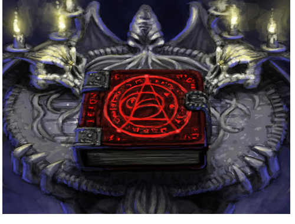
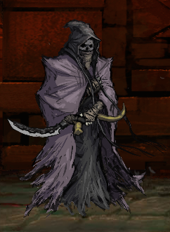
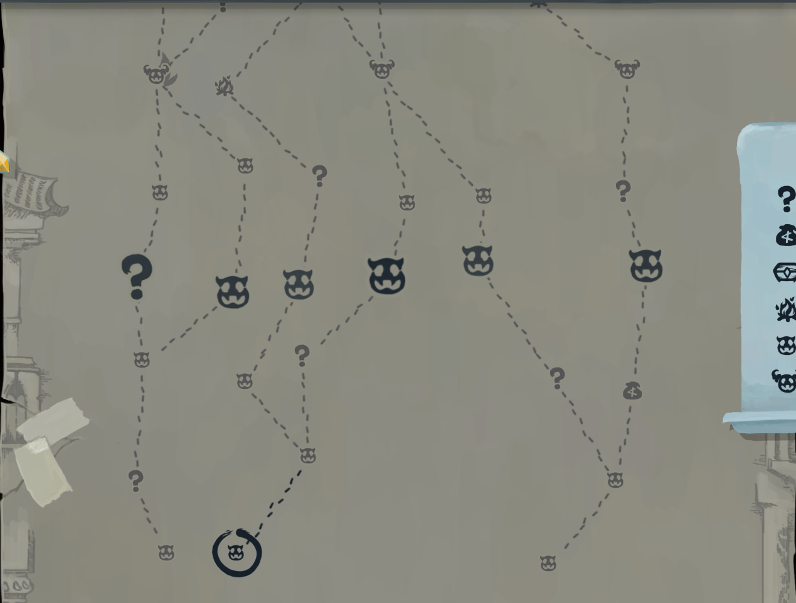

# About

Jorbs's Wanderer Trilogy is a mod for Slay The Spire that introduces 3 new playable characters:
* The Wanderer
* The CULL
* The Explorers

The mod consists of these playable characters, entirely brand new mechanics, new relics, new events, and more! Jorbs's Wanderer Trilogy is designed by Jorbs, but community-created and developed. This page serves as a mechanics overview of the mod to help new (and old) players familiarize themselves with the different additions to the game.

# New Mechanics For All Characters

## Burning
Burning is almost exactly like poison. Burning is applied through multiple different ways, either through cards, relics, or character-specific mechanics. Burning is similar to poison as the playable character stacks it on their opponent, but is different in three ways:

* **Burning does not tick down by 1, it instead decays at a rate of 33%.**
* **Burning can be BLOCKED by your opponent.**
* **Burning PREVENTS enemy healing.**

Burning is shown through a red status bar, and when it is going to be mitigated by enemy block, it will be shown as a red icon around the opponents shield.

## Ephemeral
The different characters can have a special condition on their cards called Ephemeral. This means that if a card has Ephemeral, it has a combination of 3 other card conditions:
* Exhaust
* Ethereal
* Exhaust if discarded

## Entomb
Entomb means that the card will start in the **exhaust pile**, and will only be placed in your hand when its condition is met. 
 
*For example, the Wanderer’s card “Death Throes” is **entombed** until an enemy dies, in which it will appear in the Wanderer’s current hand.*

## Legendary Cards
Legendary Cards are similar to other cards, but there is one key difference: 
* **Only one Legendary of a certain Legendary card can be in your deck at once.** 
Legendary cards have a special border so they can be more easily identified.
 

# The Wanderer
The Wanderer is the first of the Jorbs's Wanderer Trilogy characters. The Wanderer is a wizard who is battling memory loss, as well as the Spire! His memory loss is a repercussion from Neow resurrecting him over and over for her tirade against the Spire. The Wanderer is designed to provide an experience where every single turn matters. The class has a few tricks up its sleeve to get through the spire:
  

## Remembering
The Wanderer can only **remember** one memory at once. He will receive the buffs/debuffs of the certain memory he is currently in.
 
*For example, while the Wanderer is **remembering** Chastity, he will both receive 6 block at the end of his turn but also lose 1 dexterity at the end of each turn.*

## Clarity
The Wanderer can gain **clarity** of a memory to “lock in” the buffs/debuffs of a certain memory. If the Wanderer gains clarity of a memory, he will be able to **remember** other memories whilst being able to keep the buffs/debuffs of the memory he has decided to gain **clarity** of.
 
*For example, if the Wanderer is **remembering** Chastity and gains **clarity** of it, he may **remember** another memory, like Diligence, and will keep the “6 block per turn buff and -1 dexterity per turn debuff” from Chastity as well as the “retain 1 card per turn buff” from Diligence.*

## Memories
The Wanderer has access to 14 different memories. Each memory can provide a buff or debuff depending on the specific memory. A quick overview of the memories:

* **Patience** 
**While** the Wanderer is **remembering** Patience, he will have the buff Coil. Coil is a buff to the Wanderer that ticks up by one every time the Wanderer plays a card. Once the Wanderer leaves his current memory, each stack of Coil will deal 1 damage to all enemies and he will lose all Coil.  
*Note: If the Wanderer leaves a memory to **remember** Patience, he will not lose his Coil stacks.*

* **Diligence** 
When the Wanderer **begins remembering** Diligence, he will draw 2 cards. 
**While** the Wanderer is **remembering** Diligence, he will retain one card of his choice every turn.

* **Chastity** 
When the Wanderer **begins remembering** Chastity, he will gain 2 dexterity and apply 1 weak to all enemies. 
**While** the Wanderer is **remembering** Chastity, he will gain 6 block and lose 1 dexterity at the end of each turn.

* **Kindness** 
**While** the Wanderer is **remembering** Kindness, all enemies will gain a -3 strength debuff.

* **Humility** 
When the Wanderer **begins remembering** Humility, he will gain 2 thorns. 
**While** the Wanderer is **remembering** Humility, he will have double his current amount of thorns.

* **Temperance** 
**While** the Wanderer is **remembering** Temperance, he will have 1 strength per **clarity**.

* **Charity** 
**While** the Wanderer is **remembering** Charity, he will have 1 strength per 100 gold the Wanderer currently owns.

* **Lust** 
**While** the Wanderer is **remembering** Lust, his attacks will apply 2 **burning** when his attacks hit an enemy.

* **Envy** 
When the Wanderer **begins remembering** Envy, he will gain 1 vulnerable. 
**While** the Wanderer is **remembering** Envy, all cards that target an enemy will also apply 1 vulnerable to that enemy,

* **Greed** 
**While** the Wanderer is **remembering** Greed, he will gain 20 gold for every non-minion enemy he kills.

* **Wrath** 
**While** the Wanderer is **remembering** Wrath, his last attack played will gain 1 damage permanently any time a non-minion enemy dies. 
*Note: This is shown with a red flame icon underneath the energy icon on the card itself.*

* **Gluttony** 
**While** the Wanderer is **remembering** Gluttony, he must discard 1 card at the beginning of every turn. However, he will gain 2 max HP any time a non-minion enemy dies.

* **Pride** 
**While** the Wanderer is **remembering** Pride, he will lose 2 dexterity. However, a random card in his deck will be upgraded if the fight ends **While** he is **remembering** Pride.

* **Sloth** 
When the Wanderer **begins remembering** Sloth, he will discard 3 random cards in his hand. 
**While** the Wanderer is **remembering** Sloth, he will gain 1 extra energy per turn and draw one less card per turn.

## Starter Relic
The Wanderer’s starter relic is also called the Grimoire.
* Grimoire: Start each fight **remembering** Patience. Heal 1 HP per **clarity** at the end of every fight.

## Material Components
Material Component cards are mostly 0 cost cards from an entirely different selection of cards. Material Component cards cannot be picked on card reward screens and can only be obtained in combat through other cards or relics. The Material Components are small-impact cards that mainly appear on turn 7 with the appearance of The Grimoire.

## Snap
The Wanderer will **snap** at the end of turn 7. **Snapping** is almost entirely based off of clarities. When the Wanderer **snaps**, he will deal 6 damage to all enemies per **clarity**, but will also deal 3 damage per **clarity** to himself. After snapping, the Wanderer will not be able to **remember** or gain **clarity** of his memories for the rest of the fight.
 
To see what turn it is, you can hover over the flames circling the Grimoire on the Wanderer model in-game!

## The Grimoire	
The Grimoire is a legendary card that is Entombed until Turn 7 or until the Wanderer **snaps**. The Grimoire is a special card: when played, it lets you pick 1 of 3 **Material Components** to place in your hand. However, whenever the Wanderer plays 4 cards after playing The Grimoire, it will return back into the Wanderer’s hand. The Grimoire is made to give the Wanderer a big turn on Turn 7, right before he **snaps**.

# The CULL
The CULL is the second of the Jorbs's Wanderer Trilogy characters. It is a vengeful spirit who exists to only feast on the Spire, and nothing more. It offers a unique way of defeating the Spire in a more focused approach than the Wanderer.
 

## Manifest
Manifest is a mechanic which stacks up in combat, mostly by increasing by one every turn. For each Manifest the CULL accrues in a combat it has to skip a floor before it can appear again. Floors with chests or bosses are a forced stop which can’t be skipped. The CULL can also use manifest as a resource during fights, such as gaining gold based on manifest’s current number or gaining manifest to have more energy for a turn.
 
Manifest also lets the CULL have a permanent “Wing Boots” effect, in which it does not have to abide by any pathing on the map.

 
*Here, the CULL has 3 Manifest, so it must skip 2 floors and go to the third floor above it. Notice how the CULL can go to any of the available floors, as it has a permanent Wing Boots effect.*

## Losing Max HP And Intangibility
The CULL can’t gain block, it defends with max HP and intangible. Killing enemies fast is a good defense too!
 
The CULL loses 1 max hp when getting hit and loses 1 max HP for every turn in combat. Because of this, a very common way for the CULL to “die” is to lose all of its max HP in a single run.
 
*For example, if the CULL is intangible and gets hit by a Jaw Worm’s “Chomp” attack, it will lose 1 max HP for getting hit by the Jaw Worm and will lose 1 max HP for ending the turn.*

## Consume
The CULL has a unique mechanic in which it can consume its own cards. Consuming a card means that it removes the card from its deck permanently, but it receives a permanent buff/debuff based on the rarity of the card it has consumed.
 
If the CULL consumes the following card, it will receive the following buff/debuff:
* **Starter:** Heal 5 HP
* **Common:** Gain 3 max HP
* **Uncommon:** Gain 3 max hp and heal to full
* **Rare:** Gain 5 max hp and heal to full
* **Curse:** Lose 1 max hp
* **Status:** Nothing happens!

## Remembering Wrath
The CULL has a single memory: Wrath. This means that whenever the CULL kills a non-minion enemy, the last card the CULL played will gain 1 extra damage permanently.

## Self-Target
The CULL can intentionally hit itself with its own cards. Why? No idea. Only the CULL can tell you why.

# The Explorers
The Explorers are a set of two characters who work together to conquer the Spire. They are very much unfinished at this point!
