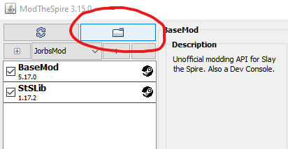
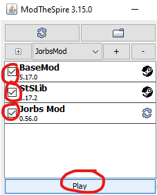

## How to install

1. Get [Slay the Spire](https://store.steampowered.com/app/646570/Slay_the_Spire/) through Steam
1. Subscribe to [StSLib](https://steamcommunity.com/sharedfiles/filedetails/?id=1609158507) in the Slay the Spire Steam Workshop.
1. Download `JorbsMod.jar` from the latest release: 
1. Launch Slay the Spire and select **Play With Mods**:
   
1. In the mod launcher, select the "open mods folder" button:
   
1. Copy `JorbsMod.jar` into this mods folder
1. Close and restart the Slay the Spire **Play With Mods** launcher
1. Make sure "BaseMod", "StSLib", and "JorbsMod" are all checked, then play!
   